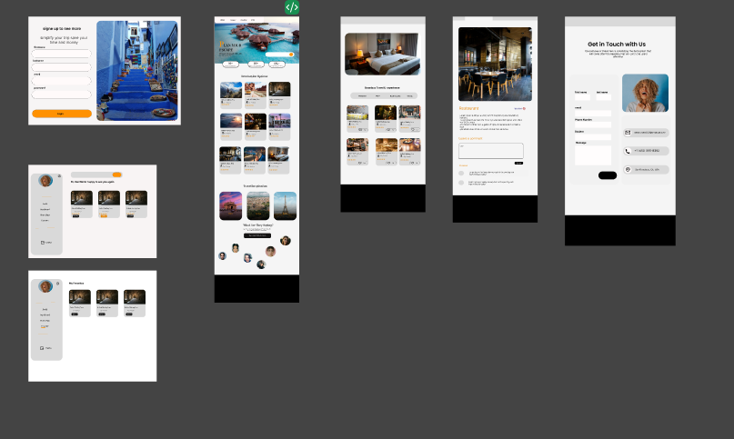
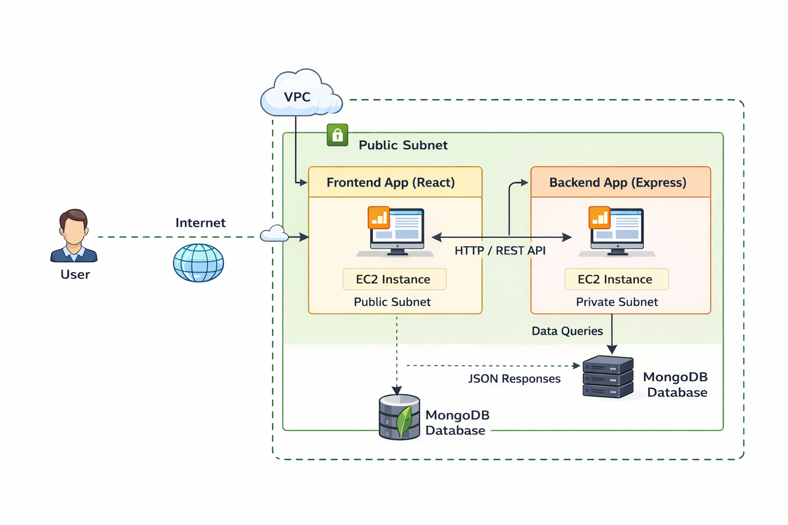

# App Guide Touristique Interactif

## 📖 Description du Projet

Ce projet est une application web dédiée à la planification de voyages. Elle permet aux utilisateurs de rechercher des destinations à travers le monde et d’accéder à des informations essentielles telles que les hôtels, les moyens de transport, les restaurants ainsi que les sites historiques et culturels.

L’application intègre également un espace administrateur sécurisé permettant la gestion des destinations et des contenus associés (ajout, modification et suppression), garantissant la fiabilité et la mise à jour continue des données proposées aux utilisateurs.

L’objectif principal de ce projet est de centraliser les informations de voyage au sein d’une plateforme intuitive afin de faciliter l’organisation et la préparation des séjours.


## Features

## 🛠️ Technologies Utilisées

- **Frontend :** React, HTML, tailwind, JavaScript  
- **Backend :** Node.js, Express.js  
- **Base de données :** MongoDB  
- **Autres outils :** GitHub, Jira, Figma


## Project Structure

This project follows a full-stack architecture with separate **backend** and **frontend** directories.
```bash
APP_GUIDE_TOURISTIQUE/
│
├── backend/
│   ├── src/
│   │   ├── config/         
│   │   ├── controllers/    
│   │   ├── middlewares/    
│   │   ├── models/         
│   │   ├── public/         
│   │   ├── repositories/   
│   │   ├── routes/         
│   │   ├── services/       
│   │   ├── app.js         
│   │   └── server.js      
│   │
│   ├── .gitignore        
│   ├── package.json       
│   ├── package-lock.json  
│   └── info.txt           
│
├── frontend/
│   └── my-app/
│       ├── node_modules/  
│       ├── public/        
│       ├── src/
│       │   ├── assets/     
│       │   ├── components/ 
│       │   ├── Data/       
│       │   ├── pages/      
│       │   ├── utils/      
│       │   ├── App.js      
│       │   ├── App.css     
│       │   ├── index.js    
│       │   └── index.css   
│       │
│       ├── package.json      
│       ├── package-lock.json 
│       ├── tailwind.config.js 
│       ├── postcss.config.js  
│       ├── README.md          
│       └── LICENSE            
│
└── README.md
```

## Installation
Make sure you have installed:

- Node.js (v16 or higher)
- npm or yarn
- MongoDB (local or MongoDB Atlas)
- Git

Check versions:

```bash
node -v
npm -v
Clone the repository
git clone https://github.com/ayoub22222222/App_Guide_Touristique_Interactif.git
cd app-guide-touristique
Install Backend dependencies
cd backend
npm install
Install Frontend dependencies
cd ../frontend/my-app
npm install 
```

## Environment Variables

## 🚀 Running the Application

This project contains:

- **Frontend:** React (`frontend/my-app`)
- **Backend:** Express + MongoDB (`backend`)
- **Database:** MongoDB (local)

---

## 📦 Prerequisites

Make sure you have installed:

- Node.js (v18+ recommended)
- npm
- MongoDB (running locally on port `27017`)

Check versions:

```bash
node -v
npm -v
mongod --version
```

## Project Management & Methodology

## Design (UI/UX)


Figma est un outil puissant pour la conception d'interfaces utilisateur (UI) et l'expérience utilisateur (UX). Il permet de créer des maquettes interactives, de collaborer en temps réel avec les équipes et de tester facilement des prototypes. Grâce à ses fonctionnalités de design et de prototypage, Figma aide à concevoir des applications et sites web intuitifs et esthétiques, tout en améliorant l'expérience globale de l'utilisateur.

## 👥 Contributions de l’équipe

Cette section présente la répartition des contributions de chaque membre du groupe, basée sur l’historique GitHub (commits, ajouts de code, suppressions et modifications).


### 🔎 Détails

- Les contributions ont été mesurées à partir des commits réalisés sur le dépôt
- Chaque membre a participé au développement du frontend, du backend et de l’intégration
- Le graphique ci-dessus illustre la quantité de code ajoutée et modifiée par personne

> 📌 Les statistiques détaillées sont disponibles dans l’onglet **Insights → Contributors** du dépôt GitHub.

## ☁️ Aperçu de l’Architecture Cloud


Cette application est déployée dans un **Virtual Private Cloud (VPC)** AWS contenant deux sous-réseaux :

- **Sous-réseau public :** héberge une instance EC2 qui exécute le frontend React. Cette instance est accessible depuis Internet et sert l’interface utilisateur.
- **Sous-réseau privé :** héberge une instance EC2 distincte qui exécute le backend Express ainsi que la base de données MongoDB. Cette instance n’est pas directement exposée à Internet pour des raisons de sécurité.

### 🔄 Flux de requêtes

1. L’**utilisateur** accède à l’application React via l’instance EC2 publique.  
2. Le frontend envoie des requêtes HTTP/REST API vers le backend situé dans le sous-réseau privé.  
3. Le backend traite la requête, interroge la **base de données MongoDB**, puis renvoie des données au format JSON.  
4. Le frontend affiche les données pour l’utilisateur.

Cette architecture améliore la sécurité en isolant le backend et la base de données dans un sous-réseau privé, tout en rendant uniquement le frontend accessible publiquement.


## License

## Team
Jihane Mansouri: mansourijihane23@gmail.com
Othamn Chafik: Chafik.otmane96@gmail.com
Selmane Oukaya: salmane_dofus@hotmail.com
Ayoub Mohammed: essbaiayoubmohammed@gmail.com
