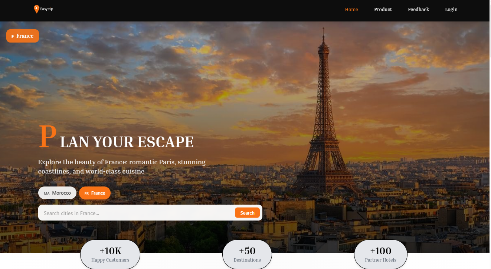

# App Guide Touristique Interactif

## 📖 Description du Projet

Ce projet est une application web dédiée à la planification de voyages. Elle permet aux utilisateurs de rechercher des destinations à travers le monde et d’accéder à des informations essentielles telles que les hôtels, les moyens de transport, les restaurants ainsi que les sites historiques et culturels.

L’application intègre également un espace administrateur sécurisé permettant la gestion des destinations et des contenus associés (ajout, modification et suppression), garantissant la fiabilité et la mise à jour continue des données proposées aux utilisateurs.

L’objectif principal de ce projet est de centraliser les informations de voyage au sein d’une plateforme intuitive afin de faciliter l’organisation et la préparation des séjours.


## Features

## 🛠️ Technologies Utilisées

- **Frontend :** React, HTML, CSS, JavaScript  
- **Backend :** Node.js, Express.js  
- **Base de données :** MongoDB  
- **Autres outils :** GitHub, Jira, Figma


## Project Structure

This project follows a full-stack architecture with separate **backend** and **frontend** directories.
```bash
APP_GUIDE_TOURISTIQUE/
│
├── backend/
│   ├── src/
│   │   ├── config/         
│   │   ├── controllers/    
│   │   ├── middlewares/    
│   │   ├── models/         
│   │   ├── public/         
│   │   ├── repositories/   
│   │   ├── routes/         
│   │   ├── services/       
│   │   ├── app.js         
│   │   └── server.js      
│   │
│   ├── .gitignore        
│   ├── package.json       
│   ├── package-lock.json  
│   └── info.txt           
│
├── frontend/
│   └── my-app/
│       ├── node_modules/  
│       ├── public/        
│       ├── src/
│       │   ├── assets/     
│       │   ├── components/ 
│       │   ├── Data/       
│       │   ├── pages/      
│       │   ├── utils/      
│       │   ├── App.js      
│       │   ├── App.css     
│       │   ├── index.js    
│       │   └── index.css   
│       │
│       ├── package.json      
│       ├── package-lock.json 
│       ├── tailwind.config.js 
│       ├── postcss.config.js  
│       ├── README.md          
│       └── LICENSE            
│
└── README.md
```

## Installation
Make sure you have installed:

- Node.js (v16 or higher)
- npm or yarn
- MongoDB (local or MongoDB Atlas)
- Git

Check versions:

```bash
node -v
npm -v
Clone the repository
git clone https://github.com/ayoub22222222/App_Guide_Touristique_Interactif.git
cd app-guide-touristique
Install Backend dependencies
cd backend
npm install
Install Frontend dependencies
cd ../frontend/my-app
npm install 
```

## Environment Variables

## Running the Application

## Project Management & Methodology

## Design (UI/UX)

## Contributing

## License

## Team
Jihane Mansouri: mansourijihane23@gmail.com
Othamn Chafik: Chafik.otmane96@gmail.com
Selmane Oukaya: salmane_dofus@hotmail.com
Ayoub Mohammed: essbaiayoubmohammed@gmail.com
